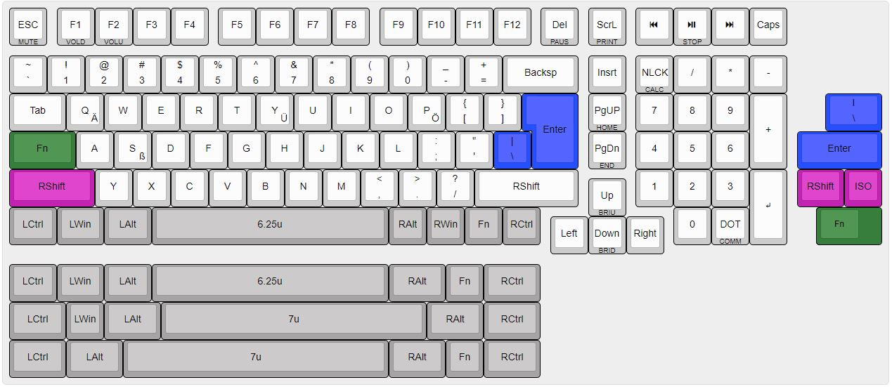

# Rabelius
A compact full sized keyboard based on coseyfannitutti mysterium

I am currently working on my own keyboard.
I really am in love with 1800s but they are very rare. Thats why I designed this compact full size board. 
It has got 105 key and full ISO and ANSI support, aswell as a stepped Caps-key possibility.

I was verry inspired by coseyfannituttis mysterium, I just like seeing the components.
BIG THANKS to coseyfannitutti for making it an open project!!

